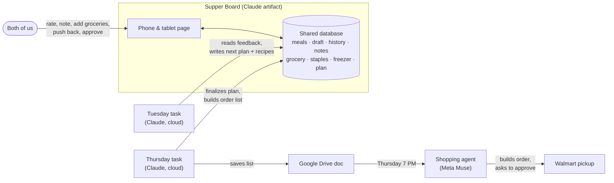

# Supper Board

A shared kitchen board for a two-person household. It shows what's for dinner tonight, the two-week plan with recipes, when to thaw things, and the next grocery order. Claude writes the meal plan every two weeks from what we liked, and a shopping agent places the Walmart pickup order.

I'm not a developer. I built all of this in an afternoon by talking to Claude: the page, the automation, and the tablet setup. This repo has everything you need to build your own.

**[Try the demo →](https://weezerhunter.github.io/Supper-Board/#today)**: sample data, runs in your browser, nothing to install.

<p>
  
  
  
</p>


## What it does

**For the two of us, on our phones and a tablet on the kitchen wall:**
- **Tonight:** what's for dinner. Tap it for the recipe, with ingredients you can check off and a "keep screen on" button for cooking.
- **Two-week plan:** about 3 cook nights a week, each batched so leftovers cover the next night, plus a flexible night.
- **Thaw reminders:** the night before a meal that uses frozen meat, the board says "Before bed: move the chicken to the fridge," with a button to mark it done.
- **Push back a day:** when plans change, slide tonight's meal and everything after it later by 1 or 2 days, with Undo. Thaw reminders move along with the meals.
- **Ratings and notes:** star each cook night and leave notes like "try with angel hair next time."
- **Shopping:** a shared "add to next order" list, pantry staples you mark Have or Low, and a freezer list.
- **Requests:** "more fish," "nothing heavy the week of the 20th." The next plan takes these into account.

**On a schedule, without anyone asking:**
- **Tuesday:** Claude checks the last order's emails for anything out of stock or substituted and fixes the board to match. Then it reads every rating, note, request, freezer item, and staple, drafts the next two weeks with original recipes and a grocery list, and posts the draft to the board as "ready to review."
- **Before Thursday:** we look it over, mark anything we don't want as "Replace," and tap **Approve**.
- **Thursday evening:** Claude swaps out the marked meals and merges the plan's groceries, our quick-adds, and Low staples into one list. It saves the list on the board and as a Google Doc.
- **Thursday 7 PM:** our shopping agent (Meta's Muse) picks up the doc, builds the Walmart pickup order, and asks us to approve it.
- **Sunday afternoon:** pickup. Week 2's proteins go straight into the freezer, and the new plan starts Monday.

All we do is rate dinners and spend about two minutes reviewing the plan and the order.

## How it works



There are three moving parts:

1. **The board** ([`board/supper-board.html`](board/supper-board.html)) is one HTML file published as a **Claude artifact**. Artifacts can have a small shared database (`window.claude.use("db")`) that updates live for everyone who opens the page. Claude can read and write it too. That's the whole backend: no server, no hosting, no accounts to manage beyond Claude itself.
2. **Two scheduled tasks** ([`automation/`](automation/)) are prompts that Claude runs on its own every week in a fresh cloud session. They read and write the same database. Each one checks the plan's dates before doing anything, so pushing the plan back automatically pushes the cycle back too.
3. **The grocery handoff.** Walmart has no public API for placing orders, so a shopping agent that can use Walmart's site does the last step. Claude never spends money; the agent asks before placing the order.

## The weekly cycle

| When | Who | What happens | Board status |
|---|---|---|---|
| Daily | Us | Cook, rate, add notes and groceries, push back if needed | `active` |
| Tue ~6:50 AM | Claude | Checks the last order for missing items, then drafts the next 2 weeks: recipes, thaw schedule, grocery list | `drafted` |
| Tue–Thu | Us | Review, mark meals to replace, **Approve** | `approved` |
| Thu ~5:50 PM | Claude | Swaps marked meals, builds the final list, saves a Google Doc | `list_ready` |
| Thu 7:00 PM | Shopping agent | Builds the Walmart pickup order and asks us to approve | |
| Thu–Fri | Us | Approve in the agent's app, tap **I placed the order** | `ordered` |
| Sun afternoon | Us | Pickup. Freeze week-2 proteins. | |
| Mon | Board | New plan is live | `active` |

## What's in this repo

```
board/supper-board.html          The board itself (publish this as a Claude artifact)
automation/
  1-plan-draft-task.md           Tuesday scheduled-task prompt (fill in the [brackets])
  2-grocery-list-task.md         Thursday scheduled-task prompt
  3-grocery-agent-handoff.md     Message to set up your shopping agent
guides/
  setup.md                       Build your own, step by step
  data-model.md                  Every collection and field the page uses
  kitchen-tablet.md              Tablet picks, Fire/Silk notes, kiosk mode, mounting
docs/                            Standalone demo (GitHub Pages) + screenshots
tools/build_demo.py              Rebuilds docs/index.html from board/
```

## Build your own

Start with **[guides/setup.md](guides/setup.md)**. In short:

1. Attach `board/supper-board.html` to a Claude chat and ask Claude to publish it as an artifact with the `db` capability.
2. Give Claude your current meal plan and ask it to load the plan using [the data model](guides/data-model.md).
3. Share the board with your household as **Editors**.
4. Ask Claude to create the two scheduled tasks from [`automation/`](automation/).
5. Hook up your shopping agent, or just use the **Copy list** button.

## Things I learned along the way

- **Plan ahead, then pause for review.** Drafting Tuesday and ordering Thursday leaves time to say no to a meal before it turns into groceries.
- **The schedule has to bend.** The most common change isn't swapping two dinners. It's "we're going out, push everything back a day." That got its own button, and the automation reads the plan's dates instead of assuming fixed ones.
- **Make thawing part of the plan.** Meals that use frozen meat carry a `thaw` field, and the board shows the reminder the night before. It's the feature we use most.
- **Use a shopping agent, not browser automation.** I first had Claude drive Chrome on my laptop to fill the Walmart cart. That works, but it needs the computer on at the right time. Handing a doc to an agent that has its own browser is more reliable.
- **Everyone needs to sign in.** The shared database only loads for signed-in people the board has been shared with. Both of us need Claude accounts, and so does the tablet.
- **Mock it up first.** I tried colors and the tablet layout in Claude Design before changing the live board.

## Limitations

- The board only runs as a Claude artifact. If you host the HTML somewhere else, it has nowhere to save data. The demo works only because of a fake database in [`docs/claude-shim.js`](docs/claude-shim.js).
- The board can't push notifications to your phones. Reminders come from the scheduled tasks, which notify the account owner, or from your calendar.
- Scheduled-task and artifact features depend on your Claude plan and may change.
- The meal plans and recipes are written by an AI. Check them against your own allergies and food-safety habits.

## License

MIT. See [LICENSE](LICENSE).
